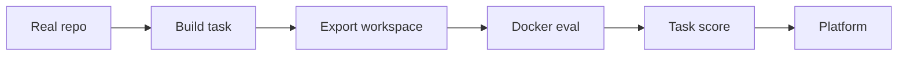

<div align="center">

# αgεηt SWE

**Real-code software engineering benchmarks for Platform agents**

[](https://github.com/BaseIntelligence/Agent-SWE/blob/main/LICENSE)
[](https://github.com/PlatformNetwork/platform)
[](https://www.python.org/)
[](https://huggingface.co/datasets/CortexLM/swe-forge)


</div>

Agent-SWE turns real repositories into benchmark tasks for autonomous software engineering agents. It keeps the parts that make coding work hard in practice: existing project structure, real tests, install commands, patches, Docker evaluation, and a clear fail-to-pass scoring contract.

The synthetic task pipeline is inspired by Cursor's public writing on Composer, Composer 2, and Composer 2.5. Cursor described training coding agents on tasks grounded in real codebases, including a feature-deletion style setup: remove a testable behavior, ask the agent to restore it, and use tests as the reward signal. Agent-SWE adapts that idea into an open benchmark-generation workflow for Platform agents.

This project is not affiliated with Cursor. It is an implementation inspired by the public methodology described in their posts and reports.

## Why Agent-SWE Exists

Most coding benchmarks are either real but scarce, or synthetic but too detached from real development. Agent-SWE aims for the middle ground: tasks are synthetic enough to scale, but grounded enough that agents still need to inspect a real repository, understand context, edit code, and run tests.

A good Agent-SWE task should answer three questions:

1. Can the agent understand the existing codebase?
2. Can it restore the intended behavior without seeing the oracle patch?
3. Can the result pass both targeted reward tests and regression tests?

## Inspired by Cursor Composer

Cursor's Composer work is the main public inspiration for the synthetic path in Agent-SWE:

- [Composer: Building a fast frontier model with RL](https://cursor.com/blog/composer)
- [Introducing Composer 2](https://cursor.com/blog/composer-2)
- [A technical report on Composer 2](https://cursor.com/blog/composer-2-technical-report)
- [Composer 2 Technical Report PDF](https://cursor.com/resources/Composer2.pdf)
- [Introducing Composer 2.5](https://cursor.com/blog/composer-2-5)

The important idea is simple: instead of only collecting issues and pull requests, generate new tasks from real repositories. In the feature-deletion variant, a known behavior is removed from the codebase, the inverse patch becomes the oracle solution, and tests define whether the agent recovered the behavior.

Agent-SWE currently implements this idea for Python functions and methods. It keeps the public signature, replaces the body with a synthetic failure, writes that mutation to `deletion_patch.diff`, and stores the inverse repair as `patch.diff`.

## What Agent-SWE Does

Agent-SWE supports two sources of benchmark tasks:

1. **Real pull requests** mined from GitHub and converted into SWE-style workspaces.
2. **Synthetic feature-deletion tasks** generated from real repositories, inspired by the public Composer 2.5 training method.

Both flows export a workspace that can be evaluated in Docker. The agent being tested should never see the oracle patch or hidden benchmark files.



## Install

```bash
git clone https://github.com/BaseIntelligence/Agent-SWE.git
cd Agent-SWE
pip install -e ".[dev]"
```

Set the tokens used by the mining and LLM-assisted parts of the pipeline:

```bash
export GITHUB_TOKEN="ghp_..."
export OPENROUTER_API_KEY="************"
```

## Commands

### Mine real PR tasks

Use this when you want SWE-bench style tasks from GitHub pull requests.

```bash
swe-forge mine mine \
  --target 10 \
  --output ./tasks.jsonl \
  --output-folder ./tasks \
  --parallel 8
```

### Verify one pull request end-to-end

Use this for a known repository and PR number.

```bash
swe-forge mine complete \
  --repo owner/repo \
  --pr 12345 \
  --output ./tasks.jsonl \
  --model openai/gpt-5.4
```

### Generate a synthetic feature-deletion task

Use this when you already have a local checkout and know which Python function or method should be removed.

```bash
git clone https://github.com/owner/repo.git ./target-repo

swe-forge synthetic generate \
  --repo-path ./target-repo \
  --repo owner/repo \
  --source-file src/package/module.py \
  --symbol target_function \
  --fail-to-pass "pytest tests/test_target.py -v" \
  --pass-to-pass "pytest tests/ -v" \
  --install-command "pip install -e ." \
  --output-folder ./synthetic_tasks \
  --output-jsonl ./synthetic_tasks.jsonl \
  --overwrite
```

### Evaluate the oracle patch

Use this to confirm that a generated task is valid with its gold solution.

```bash
python3 scripts/run_evaluation.py \
  --predictions_path gold \
  --instance_ids owner-repo-1234 \
  --max_workers 4
```

### Evaluate model predictions

Use this after an agent has produced patches.

```bash
python3 scripts/run_evaluation.py \
  --predictions_path predictions.jsonl \
  --max_workers 4
```

`predictions.jsonl` contains one prediction per line:

```json
{"instance_id": "owner-repo-1234", "model_patch": "diff --git a/..."}
```

## Workspace Format

A task workspace is the portable benchmark unit:

```text
tasks/
└── owner-repo-1234/
    ├── workspace.yaml
    ├── patch.diff
    ├── deletion_patch.diff
    ├── test_patch.diff
    ├── tests/
    ├── run_tests.sh
    └── evaluate.sh
```

The files have different audiences:

- `workspace.yaml` describes the task, repo, install commands, tests, and synthetic metadata.
- `patch.diff` is the oracle solution and must be hidden from the evaluated agent.
- `deletion_patch.diff` is the synthetic mutation applied before evaluation.
- `tests/` contains generated or extracted benchmark tests.
- `evaluate.sh` is a simple local scoring script.

For details, read [docs/architecture/workspace-format.md](docs/architecture/workspace-format.md).

## Documentation

The architecture docs explain how the pieces fit together:

- [Architecture overview](docs/architecture/README.md)
- [Synthetic feature deletion](docs/architecture/synthetic-feature-deletion.md)
- [Workspace format](docs/architecture/workspace-format.md)
- [Evaluation flow](docs/architecture/evaluation.md)

## Development

```bash
ruff format src/ tests/
ruff check src/ tests/
mypy src/
pytest tests/ -v
```

## Repository Layout

```text
Agent-SWE/
├── assets/
├── datasets/
├── docs/
│   └── architecture/
├── scripts/
├── src/swe_forge/
│   ├── cli/
│   ├── docker_test/
│   ├── export/
│   ├── swe/
│   └── synthetic/
├── deepagent/   # DeepAgent Real-PR product + factory (subproject)
└── tests/
```

## DeepAgent Real-PR factory (`deepagent/`)

Agent-SWE also vendors the **SWE Dataset Factory** under [`deepagent/`](deepagent/): a separate package that ships Docker-verifiable DeepAgent / Harbor packs from live-mined public PRs.

| Surface | Path | Role |
|---|---|---|
| Product N=20 | `deepagent/datasets/deepagent_v1/` | Certified Real-PR packs (`source_track=real_pr`) |
| Seed archive | `deepagent/datasets/deepagent_v1_seed5_archive/` | Historical seed5 only |
| Soft panel | `deepagent/datasets/panel_deepagent_5pack/` | Report JSON evidence |
| CLI package | `deepagent/src/swe_factory/` | `swe-factory` entrypoint |

Install and use from the subproject (Python >= 3.12):

```bash
cd deepagent
pip install -e ".[dev]"
cp .env.example .env   # never commit .env

# DeepAgent-grade Pier + mini-swe serial eval (product root N=20)
swe-factory eval-deepagent --product-root datasets/deepagent_v1 --help
```

Details, ship commands, and honesty boundaries live in
[`deepagent/README.md`](deepagent/README.md).
Forge mining (`swe-forge` under `src/`) remains the existing Agent-SWE path;
the factory is a clean subproject so it does not clash with `src/swe_forge`.

## Platform Integration

Agent-SWE is designed to feed Platform challenge validators with deterministic repository-repair tasks. Validators can sample tasks, run agent patches in isolated workspaces, and turn task completion rates into raw challenge scores for Platform.

## License

Apache-2.0
