<div align="center">

# DeepAgent

**Manufacture hard, Docker-verifiable SWE tasks as DeepAgent / Harbor pack trees.**

<a href="#primary-cli-deepagent">CLI</a> ·
<a href="#current-product-authoritative">Product N=9</a> ·
<a href="#huggingface-baseintelligencedeepagent">Hugging Face</a> ·
<a href="#scoreboard-m28-diversified-panel">Scoreboard</a> ·
<a href="docs/architecture.md">Architecture</a>

[](pyproject.toml)
[](pyproject.toml)
[](https://huggingface.co/datasets/BaseIntelligence/deepagent/tree/test)

</div>

---

## Overview

DeepAgent builds **agent-facing Harbor pack trees** from multi-file hard
Real-PR tasks. Each certified pack carries a real public repository URL, an
immutable base commit, multi-file gold solution, held-out verifier tests,
Docker oracle dual-truth (solution reward = 1, null reward = 0), and agent
isolation.

| Surface | Path / ref | Role |
|---|---|---|
| **Current product** | `datasets/prod_hard_deepswe_med` | DeepSWE-median hard Real-PR, **N=9** (M27 floors + M28 max 2 packs/repo, unique_repos=7) |
| **HF revision** | `BaseIntelligence/deepagent` **`test`** | Live Hub mirror of the current product |
| **Scoreboard** | `datasets/panel_prod_hard_deepswe_med_m28` | Grok 4.5 + Kimi 2.7-code dual-model matrix |
| Product detail | `datasets/prod_hard_deepswe_med/PRODUCT_README.md` | Floors, p50 stats, diversity notes |
| Historical M16 wave | `datasets/test_n10` | M16 N=10 only — **not** current product |
| Older archive | `datasets/deepagent_v1` | Real-PR archive N=20 (historical product cut) |
| Soft band | `datasets/prod_hard_keep` | M25/M26 softer band — audit only |
| Hybrid / seed archives | `datasets/deepagent_v1_*_archive/` | Historical only (never product N) |

**Primary console entrypoint:** `deepagent`
(generate / upload / pull / eval / oracle / version).

**Compatibility:** `swe-factory` still exists for historical factory stages
(`ship-deepagent`, `real-pr-pool`, `ledger`, `eval-deepagent`, archives, …).
New product work should prefer `deepagent`.

## Current product (authoritative)

| Field | Value |
|---|---|
| **Product root** | [`datasets/prod_hard_deepswe_med`](datasets/prod_hard_deepswe_med/) |
| **N** | **9** certified packs |
| **unique_repos** | **7** |
| **max packs / repo** | **2** (M28 diversity) |
| **HF dataset** | [`BaseIntelligence/deepagent`](https://huggingface.co/datasets/BaseIntelligence/deepagent) revision **`test`** |
| **Primary CLI** | `deepagent` (`generate` / `upload` / `pull` / `eval` / `oracle`) |
| **Scoreboard** | [`datasets/panel_prod_hard_deepswe_med_m28`](datasets/panel_prod_hard_deepswe_med_m28/) |
| **Default eval models** | `x-ai/grok-4.5` + `moonshotai/kimi-k2.7-code` |

### M27 DeepSWE-median hardness floors

Every keep must pass:

- **Multi-file:** source files ≥ **4**, **or** hybrid files ≥ **3** + gold added ≥ **500** + hunks ≥ **14**
- source **hunks ≥ 14**
- gold **added lines ≥ 400**
- **F2P nodes ≥ 5**
- HarborDocker **dual-truth** (sol = 1, null = 0) + prompt–verifier alignment
- live-mined `source_track=real_pr` only (no fixture pad, no hybrid motors)
- **M28 diversity:** max **2** packs per upstream repo

See [`datasets/prod_hard_deepswe_med/PRODUCT_README.md`](datasets/prod_hard_deepswe_med/PRODUCT_README.md),
`coverage_stats.json`, and `median_stats.json`.

### Pack IDs (N=9)

`realpr-click-3442` · `realpr-itemadapter-101` · `realpr-oauthlib-889` ·
`realpr-packaging-1120` · `realpr-packaging-1267` · `realpr-rich-3930` ·
`realpr-werkzeug-2637` · `realpr-werkzeug-3116` · `realpr-wtforms-923`

## Primary CLI (`deepagent`)

### Install

```bash
cd deepagent   # package root (this directory)
python3 -m venv .venv
.venv/bin/pip install -U pip
.venv/bin/pip install -e ".[dev]"
# huggingface_hub is a declared runtime dep (HF upload/pull)
cp .env.example .env   # set placeholders; never commit .env
```

Python **≥ 3.12**. Package name `deepagent` exposes:

| Entry | Module | Role |
|---|---|---|
| `deepagent` | `swe_factory.deepagent_cli:app` | **Primary** product CLI |
| `swe-factory` | `swe_factory.cli:app` | Compatibility factory CLI |

### Environment (`.env`)

Copy [`.env.example`](.env.example). Placeholders only — never commit secrets.

| Variable | Purpose |
|---|---|
| `HF_TOKEN` | Hugging Face push/pull for `BaseIntelligence/deepagent` |
| `OPENROUTER_API_KEY` | Live panel / eval model calls |
| `OPENROUTER_BASE_URL` | Default `https://openrouter.ai/api/v1` |
| `FACTORY_PANEL_MODELS` | Historical default includes k2.6; **current median panel** uses grok-4.5 + kimi-k2.7-code via explicit `--model` |
| `FACTORY_BUDGET_USD` | Hard cap (default `600`) |
| `GITHUB_TOKEN` / `GH_TOKEN` | Live Real-PR mine. Prefer `export GITHUB_TOKEN="$(gh auth token)"` after `gh auth login` |
| `OXYLABS_PROXY_URL` | **SOCKS** residential proxy for GitHub REST rate-limit relief |
| `ALL_PROXY` / `HTTPS_PROXY` | Optional proxy chain so git/HTTPS clients share the same egress |

**GitHub 429 mitigation:** authenticated REST (`GITHUB_TOKEN` / `gh auth`) plus
optional SOCKS via `OXYLABS_PROXY_URL` (and/or `ALL_PROXY` / `HTTPS_PROXY`) is the
primary anti-429 path. The Oxylabs **realtime** Web Scraper API is optional and
**not required** for GitHub REST/Search mining.

Secrets never appear in logs, CLI output, or shipped datasets.

### Commands (current product paths)

```bash
# Live-mine hard real_pr under M27 floors → prod_hard_deepswe_med
deepagent generate \
  --target 10 --min-packs 5 --max-packs 15 \
  --out datasets/prod_hard_deepswe_med \
  --live-mine --oracle docker --panel offline --pier scripted

# Push pack trees + manifest to HF revision test
deepagent upload \
  --src datasets/prod_hard_deepswe_med \
  --repo-id BaseIntelligence/deepagent \
  --revision test

# Pull packs from HF revision test
deepagent pull \
  --repo-id BaseIntelligence/deepagent \
  --revision test \
  --out datasets/hf_pull_test

# Pier mini-swe + Harbor dual-model eval (current median models)
deepagent eval \
  --product-root datasets/prod_hard_deepswe_med \
  --max-packs 9 --k 1 --n-concurrent 5 \
  --hard-stop-usd 600 \
  --model x-ai/grok-4.5 \
  --model moonshotai/kimi-k2.7-code \
  --out datasets/panel_prod_hard_deepswe_med_m28

# HarborDocker dual-truth on one pack (sol=1 / null=0)
deepagent oracle --pack-dir datasets/prod_hard_deepswe_med/tasks/realpr-click-3442

deepagent version
deepagent --help
```

| Command | What it does |
|---|---|
| `generate` | Live mine hard `real_pr` via ship-deepagent path; product out `datasets/prod_hard_deepswe_med`; Docker oracle only; refuses fixture pad |
| `upload` | Validate local pack root, push trees + `pack_manifest` to HF (`BaseIntelligence/deepagent`, default revision **`test`**) |
| `pull` | Download pack trees from HF revision (`main` or `test`) into local out dir |
| `eval` | Pier + mini-swe-agent + HarborDocker model eval (`n_concurrent` 1..5, hard-stop **$600**, fidelity **`pier_miniswe_harbor`**). Current median panel: **grok-4.5** + **kimi-k2.7-code** |
| `oracle` | HarborDocker dual-truth cert on one pack dir (solution reward 1, null 0; refuse fake) |
| `version` | Package version identity |

## Scoreboard (M28 diversified panel)

Durable dual-model matrix on the **current** product (observational ranking only;
dual-solve rate is the hardness quality gate ≤ 0.30):

| Model | pass@1 (k=1) |
|---|---|
| `x-ai/grok-4.5` | **3/9 ≈ 0.33** |
| `moonshotai/kimi-k2.7-code` | **1/9 ≈ 0.11** |
| dual_solve rate | **≈ 0.11** (1/9) |

Evidence:

- [`datasets/panel_prod_hard_deepswe_med_m28/SUMMARY.md`](datasets/panel_prod_hard_deepswe_med_m28/SUMMARY.md)
- [`datasets/panel_prod_hard_deepswe_med_m28/scoreboard.json`](datasets/panel_prod_hard_deepswe_med_m28/scoreboard.json)
- Product notes: [`datasets/prod_hard_deepswe_med/PRODUCT_README.md`](datasets/prod_hard_deepswe_med/PRODUCT_README.md)

Scoreboard is leaderboard / ranking only. Dual-model success does **not**
auto-drop hardness packs (intrinsic policy).

## Hugging Face (`BaseIntelligence/deepagent`)

| Ref | Content |
|---|---|
| **`test`** (current) | Live N=9 packs from `datasets/prod_hard_deepswe_med` |
| `main` | Reserved for larger / product cuts when promoted |

Operator loop: **generate** → **upload** (revision `test`) → **pull** →
**eval** / **oracle**. Do not embed tokens in CLI flags; use `HF_TOKEN` env /
`.env` only.

## Wave dataset vs archives

| Path | N | Status |
|---|---:|---|
| `datasets/prod_hard_deepswe_med` | **9** | **Current product** — DeepSWE-median + M28 diversity |
| HF `…/deepagent` `@test` | **9** | **Live on Hub** (mirror of current product) |
| `datasets/panel_prod_hard_deepswe_med_m28` | 9 scored | **Authoritative** Grok/Kimi2.7 scoreboard |
| `datasets/test_n10` | 10 | **Historical** M16 wave only |
| `datasets/prod_hard_keep` | ~10 | Soft M25/M26 band — audit only |
| `datasets/deepagent_v1` | 20 | Older Real-PR product archive |
| `datasets/deepagent_v1_hybrid_archive/` | ~113 | Historical hybrid motors only |
| `datasets/deepagent_v1_seed5_archive/` | seed | Historical real_pr seed only |
| `fixtures/real_pr_ship` | — | Unit / CI shortlist only — **never** product N |

## What you get in a pack

Each pack under `tasks/<task_id>/`:

```text
task.toml                 # schema 1.1, repository_url, base_commit_hash
instruction.md
pre_artifacts.sh
environment/Dockerfile    # agent image @ base SHA; offline runtime
tests/
  Dockerfile
  test.sh
  grader.py
  config.json             # fail_to_pass / pass_to_pass node ids
  test.patch              # held-out verifier tests
solution/
  solution.patch          # multi-file product sources only
  solve.sh
```

Corpus-level artifacts at the pack root:

| Artifact | Role |
|---|---|
| `pack_manifest.json` | Certified pack index + band metadata |
| `PRODUCT_README.md` | Product N, floors, diversity summary |
| `PROVENANCE.md` | License, upstream URL, base SHA, language per keep |
| `coverage_stats.json` / `median_stats.json` | Structural p50 / repo diversity |
| `report.md` | Language mix, funnel, spend, honesty notes (when present) |
| `oracle_evidence.json` / `evidence/docker/` | Docker sol/null dual-truth index |

## Architecture

```mermaid
flowchart LR
  Allow[Permissive allowlist] --> Mine[Live mine real_pr]
  Mine --> Env[Envbuild at base SHA]
  Env --> Label[Dual-run F2P / P2P]
  Label --> Oracle[Docker oracle sol=1 null=0]
  Oracle --> Export[Harbor pack export]
  Export --> Product[datasets/prod_hard_deepswe_med N=9]
  Product --> HF[HF BaseIntelligence/deepagent @test]
  HF --> Eval[deepagent eval Pier mini-swe Harbor]
  Eval --> Board[panel_prod_hard_deepswe_med_m28]
```



Git is the authority for commits and patches. Live GitHub REST prefers
`GITHUB_TOKEN` + optional SOCKS (`OXYLABS_PROXY_URL`). Realtime Oxylabs page
scrape remains optional.

## Honesty floors (brief)

- Product N counts **live-mined `real_pr` only**. Hybrid archive, seed archive,
  soft `prod_hard_keep`, historical `test_n10`, and `fixtures/real_pr_ship` never
  pad current product N.
- Docker oracle only on the certified path (`HarborDockerVerifier`); fake
  backends are refused.
- Dual-truth required: solution reward = 1, null reward = 0.
- Multi-file gold from a merged public PR; hard floors follow the
  **DeepSWE-median band** (files≥4 OR hybrid 3+500+14; hunks≥14; gold added≥400;
  F2P≥5) plus M28 **max 2 packs/repo**.
- Panel / eval spend stops under the hard budget (default **$600**); never invent
  panel spend. Current median eval models: **grok-4.5** + **kimi-k2.7-code**.
- Secrets (HF / OpenRouter / GitHub / proxy passwords) stay in env / `.env` only —
  never in help examples, logs, or uploaded trees.
- Under-supply and offline modes (panel offline, pier scripted when not live)
  must be stated honestly in ship reports.

## Compatibility CLI (`swe-factory`)

Longer factory stages remain on `swe-factory` (same package):

```bash
swe-factory --help
swe-factory ship-deepagent --help
swe-factory real-pr-pool --help
swe-factory eval-deepagent --help
swe-factory deepagent-oracle --help
swe-factory ledger
swe-factory config              # masked settings
swe-factory archive-hybrid-deepagent --json
swe-factory archive-seed5-deepagent --json
```

`deepagent generate` wraps the same honesty path as
`swe-factory ship-deepagent` (no fork of gates). `deepagent eval` / `oracle`
wrap the Pier mini-swe and HarborDocker surfaces.

## Historical surfaces (not current product)

| Path | Role |
|---|---|
| `datasets/prod_hard_deepswe_med/` | **Current product** — median + diversity, **N=9** |
| `datasets/test_n10/` | **Historical** M16 wave N=10 only |
| `datasets/prod_hard_keep/` | Soft M25/M26 band — audit only |
| `datasets/deepagent_v1/` | Older Real-PR product archive N=20 |
| `datasets/deepagent_v1_hybrid_archive/` | Historical hybrid motors (never product N) |
| `datasets/deepagent_v1_seed5_archive/` | Historical real_pr seed (never live N) |
| `fixtures/real_pr_ship` | Unit shortlist only (not product mine) |
| `datasets/harbor_v1`, `datasets/v1` | Non-product fixtures |

Milestone and product count gates use independent certified live-mined
`real_pr` N only (`prod_hard_deepswe_med` for the current median product).

Historical full ship (compat) still works for archive work:

```bash
swe-factory ship-deepagent --out datasets/deepagent_v1 \
  --source real_pr --live-mine --target 20 --min-packs 15 \
  --oracle docker --panel offline --pier scripted --json
```

On memory-constrained hosts, run Docker oracle cert **serially**.

### Archives (historical only)

```bash
swe-factory archive-hybrid-deepagent --json
# → datasets/deepagent_v1_hybrid_archive/

swe-factory archive-seed5-deepagent --json
# → datasets/deepagent_v1_seed5_archive/
```

## Tests

```bash
.venv/bin/ruff format --check src tests
.venv/bin/ruff check src tests
.venv/bin/mypy src
.venv/bin/python -m pytest tests -q -p no:cacheprovider -m "not integration"
```

Focused suites:

```bash
.venv/bin/python -m pytest tests/test_deepagent_cli.py -q -p no:cacheprovider
.venv/bin/python -m pytest tests/test_hf_packs.py -q -p no:cacheprovider
.venv/bin/python -m pytest tests/test_ship_deepagent.py -q -p no:cacheprovider
.venv/bin/python -m pytest tests/test_package_layout.py -q -p no:cacheprovider
```

Prefer `pytest -n 0` (or ≤ `-n 2`); never `pytest -n auto` on shared hosts.

## How it works

1. **Live-mine** multi-file Real-PR candidates (`deepagent generate --live-mine`).
2. **Envbuild** agent images pinned at a real base SHA with offline runtime.
3. **Label** fail-to-pass and pass-to-pass node ids via dual-run suites.
4. **Oracle-cert** with Docker: solution reward 1, null reward 0; refuse fake.
5. **Export** Harbor v1.1 tree with held-out tests and isolation-clean agent view.
6. **Upload / pull** HF mirror (`BaseIntelligence/deepagent` `@test`).
7. **Eval** Pier mini-swe + Harbor under hard-stop budget (fidelity
   `pier_miniswe_harbor`) with Grok 4.5 + Kimi 2.7-code for the current median panel.

## Documentation

| Audience | Guide | Contents |
|---|---|---|
| Operators | this README | install, CLI, HF, current product N=9 |
| Product consumers | [`datasets/prod_hard_deepswe_med/PRODUCT_README.md`](datasets/prod_hard_deepswe_med/PRODUCT_README.md) | floors, diversity, pack list |
| Scoreboard | [`datasets/panel_prod_hard_deepswe_med_m28/SUMMARY.md`](datasets/panel_prod_hard_deepswe_med_m28/SUMMARY.md) | Grok≈0.33 / Kimi2.7≈0.11 / dual≈0.11 |
| Implementers | [docs/architecture.md](docs/architecture.md) | pipeline stages and gates |
| Hardness policy | [docs/PRODUCT_HARDNESS.md](docs/PRODUCT_HARDNESS.md) | DeepSWE-median floors, intrinsic, opt-out |
| Historical M16 wave | `datasets/test_n10/report.md` | M16 N=10 mix (historical only) |
| Older archive | `datasets/deepagent_v1/report.md` | N=20 corpus and provenance |

## Repository layout

```text
src/swe_factory/
  deepagent_cli.py       # primary deepagent entrypoint
  cli.py                 # swe-factory compatibility entrypoint
  export/hf_packs.py     # HF upload / pull
  panel/eval_deepagent.py
  pipeline/ship_deepagent.py
  harbor/                # pack export + docker oracle cert
  producers/             # mine / motors / labeling
  sources/               # allowlist, git mine, oxylabs / SOCKS proxy
  accounting.py          # exact ledger under $600 cap
datasets/
  prod_hard_deepswe_med/             # CURRENT product: median + diversity N=9
  panel_prod_hard_deepswe_med_m28/   # authoritative Grok/Kimi2.7 scoreboard
  test_n10/                          # historical M16 wave N=10
  prod_hard_keep/                    # soft M25/M26 band (audit)
  deepagent_v1/                      # older product archive N=20
  deepagent_v1_hybrid_archive/
  deepagent_v1_seed5_archive/
  harbor_v1/                         # historical Harbor motors fixture
  v1/                                # historical boltons V1 export
fixtures/
  real_pr_ship/                      # unit shortlist only (not product mine)
tests/
docs/
  architecture.md
  PRODUCT_HARDNESS.md
```

## Limits and non-goals

- Current product N is `prod_hard_deepswe_med` / HF `test` only. Historical
  `test_n10`, soft `prod_hard_keep`, hybrid/seed/fixture surfaces never substitute.
- Not a browser UI; CLI + Docker + Pier only.
- Copyleft / unknown licenses are fail-closed and never appear in PROVENANCE.
- On constrained hosts, prefer serial Docker cert and lower `n_concurrent` eval.

## Spend

| Metric | Value |
|---|---|
| Cap | $600 (`FACTORY_BUDGET_USD` / eval hard-stop) |
| Default eval concurrency | 1 (allowlist 1..5) |
| Current median eval models | grok-4.5 · kimi-k2.7-code |
| M28 panel spend (durable) | ≈ $23.64 under cap |
| Eval fidelity | `pier_miniswe_harbor` |

Source of truth: panel `ledger_summary.json` and (compat) `swe-factory ledger`.

## License

MIT (see `pyproject.toml`).
