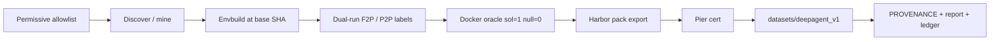

<div align="center">

# SWE Dataset Factory

**Manufacture hard, Docker-verifiable SWE tasks as DeepAgent / Harbor pack trees.**

<a href="#ship-deepagent-v1">Ship DeepAgent</a> ·
<a href="#cli-swe-factory">CLI</a> ·
<a href="docs/architecture.md">Architecture</a> ·
<a href="#historical-fixtures-non-product">Fixtures</a>

[](pyproject.toml)
[](pyproject.toml)

</div>

---

## Overview

SWE Dataset Factory builds **agent-facing Harbor / DeepAgent pack trees** from
multi-file hard tasks. Each certified pack carries a real public repository URL,
an immutable base commit, multi-file gold solution, held-out verifier tests,
Docker oracle dual-truth (solution reward = 1, null reward = 0), agent
isolation, and optional hardness-panel evidence.

**Product surface:** `datasets/deepagent_v1` — **N=20** certified packs,
`source_track=real_pr`, **live-mined** (not a fixture shortlist),
`materials_is_fixture=false`. Docker oracle only via `HarborDockerVerifier`
(solution reward = 1, null reward = 0); fake backends refused on the certified
path. Language mix: **python 17 · javascript 2 · rust 1**.

Hard floors for product keeps: **≥10 source hunks**, real-suite dual-run labels
(F2P/P2P), and Harbor Docker dual-truth. Pier mode on the current ship is
**scripted** (do not claim live pier). Panel mode is offline on this wave;
ledger spend is project OpenRouter settle only — do not invent panel spend.

**Archives (historical only, never product N):**

| Path | Role |
|---|---|
| `datasets/deepagent_v1_hybrid_archive/` | Sealed hybrid_curated motors (N≈113) |
| `datasets/deepagent_v1_seed5_archive/` | Prior real_pr seed product (seed5) |

`fixtures/real_pr_ship` is **unit-only** (CI / offline shortlist). It is **not**
the product mine and must never pad product N. Historical regression surfaces
`datasets/harbor_v1` and `datasets/v1` are fixtures only.

## Architecture



Git is the authority for commits and patches. Optional GitHub page HTTP can go
through Oxylabs (`source=universal` only) when credentials are configured.

## What you get in a DeepAgent pack

Each pack under `datasets/deepagent_v1/tasks/<task_id>/`:

```text
task.toml                 # schema 1.1, repository_url, base_commit_hash
instruction.md
pre_artifacts.sh
environment/Dockerfile    # agent image @ base SHA; offline runtime
tests/
  Dockerfile
  test.sh
  grader.py
  config.json             # fail_to_pass / pass_to_pass node ids
  test.patch              # held-out verifier tests
solution/
  solution.patch          # multi-file product sources only
  solve.sh
```

Corpus-level ship artifacts:

| Artifact | Role |
|---|---|
| `pack_manifest.json` | Certified pack index + band metadata |
| `PROVENANCE.md` | One row per keep: license, upstream URL, base SHA, language |
| `report.md` | Language mix, funnel, spend, honesty notes |
| `ledger_summary.json` | Exact OpenRouter spend vs $600 cap |
| `oracle_evidence.json` | Docker sol/null dual-truth index |
| `pier_evidence.json` | Pier load / oracle evidence |

## Hybrid archive (before real-PR product overwrite)

Archive the sealed hybrid motor corpus **before** any real-PR promote writes
into `datasets/deepagent_v1`:

```bash
# Idempotent: copy hybrid packs → archive (does not delete product here)
swe-factory archive-hybrid-deepagent \
  --source datasets/deepagent_v1 \
  --archive datasets/deepagent_v1_hybrid_archive \
  --json
```

| Path | Role |
|---|---|
| `datasets/deepagent_v1_hybrid_archive/` | Sealed hybrid_curated motors (**historical only**) |
| `datasets/deepagent_v1_seed5_archive/` | Prior real_pr seed (**historical only**) |
| `datasets/deepagent_v1/` | **Product** — live-mined real_pr (N=20) |
| `fixtures/real_pr_ship` | Unit shortlist only (not product mine) |
| `datasets/harbor_v1`, `datasets/v1` | Fixtures only (non-product) |

Evidence after a successful archive:

- `datasets/deepagent_v1_hybrid_archive/pack_manifest.json`
- `datasets/deepagent_v1_hybrid_archive/tasks/<pack_id>/`
- `datasets/deepagent_v1_hybrid_archive/ARCHIVE_README.md`
- `datasets/deepagent_v1_hybrid_archive/archive_report.json`

Re-running `archive-hybrid-deepagent` is safe (idempotent no-op when the archive
already holds pack_manifest + tasks). Product clear/overwrite happens only in
the real-PR ship step **after** archive verification. Hybrid is never claimed
as the current certified product corpus.

## DeepAgent v1 product (live-mined real_pr)

**Current product:** `datasets/deepagent_v1` ships **N=20** certified Real-PR
packs (`source_track=real_pr`, live-mined materials, `materials_is_fixture=false`,
clone@SHA agent trees, real-suite dual-run, `HarborDockerVerifier` sol=1 / null=0).

| Language | Certified |
|---|---:|
| python | 17 |
| javascript | 2 |
| rust | 1 |
| **total** | **20** |

Hard floors: ≥10 source hunks, multi-file gold from a merged public PR, held-out
`tests/test.patch`, dual-run F2P/P2P labels, Docker sol=1/null=0. Pier on the
current corpus is **scripted**; panel is offline (no invented panel spend).

Archives (not product N): hybrid motors under
`datasets/deepagent_v1_hybrid_archive/`; prior seed under
`datasets/deepagent_v1_seed5_archive/`. See archive `PROVENANCE.md` / `report.md`.

## Historical fixtures (non-product)

| Surface | Path | Status |
|---|---|---|
| Hybrid DeepAgent motors | `datasets/deepagent_v1_hybrid_archive` | **Historical hybrid archive only** |
| Seed5 real_pr product | `datasets/deepagent_v1_seed5_archive` | **Historical real_pr seed only** |
| Real-PR unit shortlist | `fixtures/real_pr_ship` | **Unit / CI only — not product mine** |
| Harbor motors (synth) | `datasets/harbor_v1` | **Historical fixture / regression only** |
| V1 boltons JSONL | `datasets/v1` | **Historical fixture / regression only** |
| DeepAgent product | `datasets/deepagent_v1` | **Product north star (live-mined real_pr, N=20)** |

- `datasets/deepagent_v1_hybrid_archive`: archived hybrid_curated motors.
  **Not** the Real-PR product; do not count archive N as product N.
- `datasets/deepagent_v1_seed5_archive`: prior real_pr seed product archived
  before live-mine overwrite. **Not** current product N.
- `fixtures/real_pr_ship`: offline unit shortlist for tests. **Never** pad
  product N; product materials are live-mined (not fixture).
- `datasets/harbor_v1`: twelve multi-language synthetic motors; may still use a
  non-Docker offline oracle for fixture demos. **Not** DeepAgent Real-PR product.
- `datasets/v1`: twenty multi-file boltons synthetic keeps for older V1 export
  path tests. **Not** DeepAgent Real-PR product.
- Milestone and product count gates use **only** independent
  `datasets/deepagent_v1` certified live-mined `real_pr` N.

## Ship DeepAgent v1

### Setup

```bash
cd /projects/deepagent
python3 -m venv .venv
.venv/bin/pip install -U pip
.venv/bin/pip install -e ".[dev]"
cp .env.example .env   # set keys as needed; never commit .env
```

Python **≥ 3.12**. Console entrypoint: `swe-factory`.

### Configuration (`.env`)

| Variable | Purpose |
|---|---|
| `OPENROUTER_API_KEY` | Live teacher / hardness panel |
| `OPENROUTER_BASE_URL` | Default `https://openrouter.ai/api/v1` |
| `FACTORY_TEACHER_MODEL` | Default `anthropic/claude-opus-4.8` |
| `FACTORY_PANEL_MODELS` | Grok / Kimi / Opus panel triad |
| `FACTORY_BUDGET_USD` | Hard cap (default `600`) |
| `OXYLABS_USERNAME` / `OXYLABS_PASSWORD` | Optional; live GitHub HTTP via universal source |
| `GITHUB_TOKEN` or `GH_TOKEN` | Live Real-PR mine (`real-pr-pool --live`). Prefer `gh auth login` so `gh auth token` can supply the token |

Secrets never appear in logs, CLI output, or exported datasets. Scannable
secrets are fail-closed on the certified path.

### Archive legacy product first (before live-mine overwrite)

```bash
swe-factory archive-hybrid-deepagent --json
# → datasets/deepagent_v1_hybrid_archive/

swe-factory archive-seed5-deepagent --json
# → datasets/deepagent_v1_seed5_archive/  (prior real_pr seed; not live N)
```

### Live-mine product packs (Real-PR M14)

Product materials are **live-mined**, not `fixtures/real_pr_ship`. Recommend
GitHub auth first (`gh auth login` or set `GITHUB_TOKEN` / `GH_TOKEN`):

```bash
# 1) Live merged-PR pool (Search / list_pulls; needs token + network)
swe-factory real-pr-pool --live --out datasets/real_pr_pool_live --json

# 2) Ship product with --live-mine (refuses fixture pad of productN)
swe-factory ship-deepagent --out datasets/deepagent_v1 \
  --source real_pr --live-mine --target 20 --min-packs 15 \
  --oracle docker --panel offline --pier scripted --json

# Fake oracle and hybrid bind are hard-refused on the product path (non-zero)
swe-factory ship-deepagent --oracle fake                   # exit 2
swe-factory ship-deepagent --source real_pr --hybrid-bind  # exit 2
```

On memory-constrained hosts, Docker oracle cert may need **serial** runs
(avoid unbounded parallel cert containers).

Product truth (current wave):

| Path | Role |
|---|---|
| `datasets/deepagent_v1/` | **Product** — live-mined `source_track=real_pr`, **N=20** |
| `datasets/deepagent_v1_hybrid_archive/` | Historical hybrid motors (never product N) |
| `datasets/deepagent_v1_seed5_archive/` | Historical real_pr seed (never live N) |
| `fixtures/real_pr_ship` | Unit shortlist only (not product mine) |
| `datasets/harbor_v1`, `datasets/v1` | Non-product fixtures |

Each real_pr pack carries a clone@SHA agent Dockerfile, multi-file gold from a
merged GitHub PR (≥10 source hunks), held-out `tests/test.patch`, real-suite
dual-run labels, Docker oracle sol=1 / null=0 (`HarborDockerVerifier`), and pier
evidence (scripted on this ship). `PROVENANCE.md` / `report.md` count
**real_pr only**.

### Related stage commands

```bash
swe-factory --help
swe-factory config              # masked settings
swe-factory ledger              # exact spend vs $600
swe-factory archive-hybrid-deepagent --help
swe-factory archive-seed5-deepagent --help
swe-factory real-pr-pool --help
swe-factory ship-deepagent --help
swe-factory discover --help
swe-factory mine-allowlist --help
swe-factory deepagent-oracle --help
swe-factory pier-cert --help
swe-factory oxylabs-probe --json --out datasets/oxylabs_probe_val_oxy_005.json
```

`oxylabs-probe` records an honest `status=blocked` when credentials are absent;
it never invents a pass.

### Historical fixture ships (not product)

```bash
# Offline Harbor motors fixture (12 packs) — regression only
swe-factory ship-harbor --out datasets/harbor_v1 --target 12

# Older V1 boltons JSONL export — regression only
swe-factory ship-v1 --out datasets/v1 --target 20 --offline
```

## CLI (`swe-factory`)

```bash
swe-factory --help
swe-factory build …
swe-factory envbuild …
swe-factory export …
swe-factory score …
swe-factory offline-fixture --out datasets/fixture_demo
```

Unit and package checks:

```bash
.venv/bin/ruff format --check src tests
.venv/bin/ruff check src tests
.venv/bin/mypy src
.venv/bin/python -m pytest tests -q -p no:cacheprovider -m "not integration"
```

Focused shipping suites:

```bash
.venv/bin/python -m pytest tests/test_ship_deepagent.py -q -p no:cacheprovider
.venv/bin/python -m pytest tests/test_package_layout.py -q -p no:cacheprovider
```

## How it works

1. **Discover / live-mine** multi-file Real-PR candidates (`real-pr-pool --live`;
   GitHub token recommended; optional Oxylabs for page HTTP).
2. **Envbuild** agent images pinned at a real base SHA with offline runtime.
3. **Label** fail-to-pass and pass-to-pass node ids via dual-run suites.
4. **Oracle-cert** with Docker: solution reward 1, null reward 0; refuse fake.
5. **Export** Harbor v1.1 tree with held-out tests and isolation-clean agent view.
6. **Pier-load** proof and optional hardness panel while budget remains.
7. **Ship** to `datasets/deepagent_v1` with PROVENANCE, report, and ledger.

## Documentation

| Audience | Guide | Contents |
|---|---|---|
| New operators | this README | setup, ship, fixture labeling |
| Implementers | [docs/architecture.md](docs/architecture.md) | pipeline stages and gates |
| Consumers of packs | `datasets/deepagent_v1/report.md` | corpus mix and honesty notes |
| License audit | `datasets/deepagent_v1/PROVENANCE.md` | license / URL / SHA per keep |

## Repository layout

```text
src/swe_factory/
  cli.py                 # swe-factory entrypoint
  pipeline/ship_deepagent.py
  harbor/                # pack export + docker oracle cert
  producers/             # mine / motors / labeling
  sources/               # allowlist, git mine, oxylabs client
  accounting.py          # exact ledger under $600 cap
fixtures/                # offline regression trees
datasets/
  deepagent_v1/              # PRODUCT: live-mined real_pr N=20
  deepagent_v1_hybrid_archive/  # historical hybrid motors
  deepagent_v1_seed5_archive/   # historical real_pr seed
  harbor_v1/               # historical Harbor motors fixture
  v1/                      # historical boltons V1 export
fixtures/
  real_pr_ship/            # unit shortlist only (not product mine)
tests/
docs/
  architecture.md
```

## Limits and non-goals

- Product count is **`datasets/deepagent_v1` only** (live-mined real_pr). Hybrid
  archive, seed5 archive, `fixtures/real_pr_ship`, Harbor motors, and boltons
  never substitute for product N.
- Current language mix: python 17, javascript 2, rust 1. Under-supply must be
  stated honestly in the ship report (no hybrid fill-in).
- Copyleft / unknown licenses are fail-closed and never appear in PROVENANCE.
- Not the DeepAgent forge authority / recovery stack; CLI + Docker + Pier, no browser UI.
- Panel spend stops when remaining budget hits $0. Mining and docker-oracle work
  may continue only without inventing panel calls. Current wave: panel offline,
  pier scripted — do not claim live pier or fabricated panel spend.
- On constrained hosts, prefer serial Docker cert to bound memory.

## Spend

| Metric | Value |
|---|---|
| Cap | $600 |
| Settled (project ledger) | ~$3.460345 |
| Remaining | ~$596.54 |
| Under cap | yes |
| This wave panel provider calls | 0 (panel offline) |

Source of truth: `swe-factory ledger` and `datasets/deepagent_v1/ledger_summary.json`.

## License

MIT (see `pyproject.toml`).
