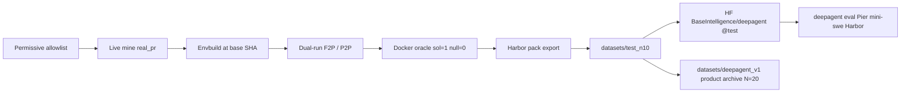

<div align="center">

# DeepAgent

**Manufacture hard, Docker-verifiable SWE tasks as DeepAgent / Harbor pack trees.**

<a href="#primary-cli-deepagent">CLI</a> ·
<a href="#huggingface-baseintelligencedeepagent">Hugging Face</a> ·
<a href="#ship-deepagent-v1-product-archive">Product N=20</a> ·
<a href="docs/architecture.md">Architecture</a>

[](pyproject.toml)
[](pyproject.toml)
[](https://huggingface.co/datasets/BaseIntelligence/deepagent)

</div>

---

## Overview

DeepAgent builds **agent-facing Harbor pack trees** from multi-file hard
Real-PR tasks. Each certified pack carries a real public repository URL, an
immutable base commit, multi-file gold solution, held-out verifier tests,
Docker oracle dual-truth (solution reward = 1, null reward = 0), and agent
isolation.

| Surface | Path / ref | Role |
|---|---|---|
| **Wave dataset (M16)** | `datasets/test_n10` | Live-mined hard Real-PR, **N=10** sealed this wave |
| **HF revision** | `BaseIntelligence/deepagent` **`test`** | N=10 packs live (upload/pull) |
| **Product archive** | `datasets/deepagent_v1` | Product N=20 Real-PR archive |
| Hybrid / seed archives | `datasets/deepagent_v1_*_archive/` | Historical only (never product N) |

**Primary console entrypoint:** `deepagent`
(generate / upload / pull / eval / oracle / version).

**Compatibility:** `swe-factory` still exists for historical factory stages
(`ship-deepagent`, `real-pr-pool`, `ledger`, `eval-deepagent`, archives, …).
New product work should prefer `deepagent`.

## Primary CLI (`deepagent`)

### Install

```bash
cd deepagent   # package root (this directory)
python3 -m venv .venv
.venv/bin/pip install -U pip
.venv/bin/pip install -e ".[dev]"
# huggingface_hub is a declared runtime dep (HF upload/pull)
cp .env.example .env   # set keys; never commit .env
```

Python **≥ 3.12**. Package name `deepagent` exposes:

| Entry | Module | Role |
|---|---|---|
| `deepagent` | `swe_factory.deepagent_cli:app` | **Primary** product CLI |
| `swe-factory` | `swe_factory.cli:app` | Compatibility factory CLI |

### Environment (`.env`)

| Variable | Purpose |
|---|---|
| `HF_TOKEN` | Hugging Face push/pull for `BaseIntelligence/deepagent` |
| `OPENROUTER_API_KEY` | Live panel / eval model calls |
| `OPENROUTER_BASE_URL` | Default `https://openrouter.ai/api/v1` |
| `FACTORY_PANEL_MODELS` | Default `x-ai/grok-4.5,moonshotai/kimi-k2.6` |
| `FACTORY_BUDGET_USD` | Hard cap (default `600`) |
| `GITHUB_TOKEN` / `GH_TOKEN` | Live Real-PR mine. Prefer `gh auth login` so `gh auth token` can supply the token |

Secrets never appear in logs, CLI output, or shipped datasets.

### Commands (M16)

```bash
# Live-mine hard real_pr → datasets/test_n10 (N=10 sealed this wave)
deepagent generate --target 10 --out datasets/test_n10 --live-mine

# Push pack trees + manifest to HF revision test
deepagent upload --src datasets/test_n10 \
  --repo-id BaseIntelligence/deepagent --revision test

# Pull packs from HF revision test
deepagent pull --repo-id BaseIntelligence/deepagent --revision test \
  --out datasets/hf_pull_test

# Pier mini-swe + Harbor model eval (serial; hard-stop $600)
deepagent eval --product-root datasets/hf_pull_test \
  --n-concurrent 1 --hard-stop-usd 600 --max-packs 5

# HarborDocker dual-truth on one pack (sol=1 / null=0)
deepagent oracle --pack-dir datasets/test_n10/tasks/<id>

deepagent version
deepagent --help
```

| Command | What it does |
|---|---|
| `generate` | Live mine hard `real_pr` via ship-deepagent path; default out `datasets/test_n10`, target 10; Docker oracle only; refuses fixture pad |
| `upload` | Validate local pack root, push trees + `pack_manifest` to HF (`BaseIntelligence/deepagent`, default revision **`test`**) |
| `pull` | Download pack trees from HF revision (`main` or `test`) into local out dir |
| `eval` | Pier + mini-swe-agent + HarborDocker serial model eval (`n_concurrent=1`, hard-stop **$600**, fidelity **`pier_miniswe_harbor`**, models **grok-4.5** + **kimi-k2.6**) |
| `oracle` | HarborDocker dual-truth cert on one pack dir (solution reward 1, null 0; refuse fake) |
| `version` | Package version identity |

## Hugging Face (`BaseIntelligence/deepagent`)

| Ref | Content |
|---|---|
| **`test`** (M16) | Live N=10 packs from `datasets/test_n10` |
| `main` | Reserved for larger / product cuts when promoted |

M16 operator loop: **generate** → **upload** (revision `test`) → **pull** →
**eval** / **oracle**. Do not embed tokens in CLI flags; use `HF_TOKEN` env /
`.env` only.

## Wave dataset vs product archive

| Path | N | Status |
|---|---:|---|
| `datasets/test_n10` | **10** | **Current wave** — live-mined hard Real-PR (M16 sealed) |
| HF `…/deepagent` `@test` | **10** | **Live on Hub** (mirror of wave) |
| `datasets/deepagent_v1` | **20** | **Product archive** (still product N=20 Real-PR) |
| `datasets/deepagent_v1_hybrid_archive/` | ~113 | Historical hybrid motors only |
| `datasets/deepagent_v1_seed5_archive/` | seed | Historical real_pr seed only |
| `fixtures/real_pr_ship` | — | Unit / CI shortlist only — **never** product N |

## What you get in a pack

Each pack under `tasks/<task_id>/`:

```text
task.toml                 # schema 1.1, repository_url, base_commit_hash
instruction.md
pre_artifacts.sh
environment/Dockerfile    # agent image @ base SHA; offline runtime
tests/
  Dockerfile
  test.sh
  grader.py
  config.json             # fail_to_pass / pass_to_pass node ids
  test.patch              # held-out verifier tests
solution/
  solution.patch          # multi-file product sources only
  solve.sh
```

Corpus-level artifacts at the pack root:

| Artifact | Role |
|---|---|
| `pack_manifest.json` | Certified pack index + band metadata |
| `PROVENANCE.md` | License, upstream URL, base SHA, language per keep |
| `report.md` | Language mix, funnel, spend, honesty notes |
| `ledger_summary.json` | Exact OpenRouter spend vs $600 cap |
| `oracle_evidence.json` | Docker sol/null dual-truth index |
| `pier_evidence.json` | Pier load / oracle evidence |

## Architecture



Git is the authority for commits and patches. Optional GitHub page HTTP can go
through Oxylabs (`source=universal` only) when credentials are configured.

## Honesty floors (brief)

- Product / wave N counts **live-mined `real_pr` only**. Hybrid archive, seed
  archive, and `fixtures/real_pr_ship` never pad N.
- Docker oracle only on the certified path (`HarborDockerVerifier`); fake
  backends are refused.
- Dual-truth required: solution reward = 1, null reward = 0.
- Multi-file gold from a merged public PR; hard floors include **≥10 source
  hunks** and real-suite F2P/P2P labels where product cert applies.
- Panel / eval spend stops under the hard budget (default **$600**); never invent
  panel spend. Default eval models: **grok-4.5** + **kimi-k2.6**.
- Secrets (HF / OpenRouter / GitHub) stay in env / `.env` only — never in help
  examples, logs, or uploaded trees.
- Under-supply and offline modes (panel offline, pier scripted when not live)
  must be stated honestly in ship reports.

## Compatibility CLI (`swe-factory`)

Longer factory stages remain on `swe-factory` (same package):

```bash
swe-factory --help
swe-factory ship-deepagent --help
swe-factory real-pr-pool --help
swe-factory eval-deepagent --help
swe-factory deepagent-oracle --help
swe-factory ledger
swe-factory config              # masked settings
swe-factory archive-hybrid-deepagent --json
swe-factory archive-seed5-deepagent --json
```

`deepagent generate` wraps the same honesty path as
`swe-factory ship-deepagent` (no fork of gates). `deepagent eval` / `oracle`
wrap the Pier mini-swe and HarborDocker surfaces.

## Ship DeepAgent v1 (product archive)

**Product surface / product north star:** `datasets/deepagent_v1` — **N=20**
certified Real-PR packs (`source_track=real_pr`, live-mined,
`materials_is_fixture=false`). Language mix on that corpus:
**python 17 · javascript 2 · rust 1**.

Use `swe-factory` build / export / score stages on the compatibility CLI when
you need full factory panels or ledger scoring alongside `deepagent generate`.

M16 wave work targets `datasets/test_n10` + HF **`test`**, not a rewrite of
product N=20. Prefer:

```bash
deepagent generate --target 10 --out datasets/test_n10 --live-mine
```

Historical full ship (compat) still works:

```bash
swe-factory ship-deepagent --out datasets/deepagent_v1 \
  --source real_pr --live-mine --target 20 --min-packs 15 \
  --oracle docker --panel offline --pier scripted --json
```

On memory-constrained hosts, run Docker oracle cert **serially**.

### Archives (historical only)

```bash
swe-factory archive-hybrid-deepagent --json
# → datasets/deepagent_v1_hybrid_archive/

swe-factory archive-seed5-deepagent --json
# → datasets/deepagent_v1_seed5_archive/
```

| Path | Role |
|---|---|
| `datasets/deepagent_v1/` | **Product archive** — live-mined real_pr, **N=20** |
| `datasets/test_n10/` | **M16 wave** — live-mined real_pr, **N=10** |
| `datasets/deepagent_v1_hybrid_archive/` | Historical hybrid motors (never product N) |
| `datasets/deepagent_v1_seed5_archive/` | Historical real_pr seed (never live N) |
| `fixtures/real_pr_ship` | Unit shortlist only (not product mine) |
| `datasets/harbor_v1`, `datasets/v1` | Non-product fixtures |

## Historical fixtures (non-product)

| Surface | Path | Status |
|---|---|---|
| Wave N=10 | `datasets/test_n10` | **M16 wave product path** |
| Product N=20 | `datasets/deepagent_v1` | **Product archive** |
| Hybrid motors | `datasets/deepagent_v1_hybrid_archive` | Historical only |
| Seed5 real_pr | `datasets/deepagent_v1_seed5_archive` | Historical only |
| Real-PR unit shortlist | `fixtures/real_pr_ship` | Unit / CI only — not product mine |
| Harbor motors (synth) | `datasets/harbor_v1` | Fixture / regression only |
| V1 boltons JSONL | `datasets/v1` | Fixture / regression only |

Milestone and product count gates use independent certified live-mined
`real_pr` N only (`test_n10` for this wave; `deepagent_v1` for the N=20 archive).

## Tests

```bash
.venv/bin/ruff format --check src tests
.venv/bin/ruff check src tests
.venv/bin/mypy src
.venv/bin/python -m pytest tests -q -p no:cacheprovider -m "not integration"
```

Focused suites:

```bash
.venv/bin/python -m pytest tests/test_deepagent_cli.py -q -p no:cacheprovider
.venv/bin/python -m pytest tests/test_hf_packs.py -q -p no:cacheprovider
.venv/bin/python -m pytest tests/test_ship_deepagent.py -q -p no:cacheprovider
.venv/bin/python -m pytest tests/test_package_layout.py -q -p no:cacheprovider
```

## How it works

1. **Live-mine** multi-file Real-PR candidates (`deepagent generate --live-mine`).
2. **Envbuild** agent images pinned at a real base SHA with offline runtime.
3. **Label** fail-to-pass and pass-to-pass node ids via dual-run suites.
4. **Oracle-cert** with Docker: solution reward 1, null reward 0; refuse fake.
5. **Export** Harbor v1.1 tree with held-out tests and isolation-clean agent view.
6. **Upload / pull** optional HF mirror (`BaseIntelligence/deepagent` `@test`).
7. **Eval** Pier mini-swe + Harbor under hard-stop budget (fidelity
   `pier_miniswe_harbor`).

## Documentation

| Audience | Guide | Contents |
|---|---|---|
| Operators | this README | install, CLI, HF, honesty floors |
| Implementers | [docs/architecture.md](docs/architecture.md) | pipeline stages and gates |
| Wave consumers | `datasets/test_n10/report.md` | M16 N=10 mix and honesty notes |
| Product archive | `datasets/deepagent_v1/report.md` | N=20 corpus and provenance |

## Repository layout

```text
src/swe_factory/
  deepagent_cli.py       # primary deepagent entrypoint
  cli.py                 # swe-factory compatibility entrypoint
  export/hf_packs.py     # HF upload / pull
  panel/eval_deepagent.py
  pipeline/ship_deepagent.py
  harbor/                # pack export + docker oracle cert
  producers/             # mine / motors / labeling
  sources/               # allowlist, git mine, oxylabs client
  accounting.py          # exact ledger under $600 cap
datasets/
  test_n10/                  # M16 wave: live-mined real_pr N=10
  deepagent_v1/              # product archive: real_pr N=20
  deepagent_v1_hybrid_archive/
  deepagent_v1_seed5_archive/
  harbor_v1/                 # historical Harbor motors fixture
  v1/                        # historical boltons V1 export
fixtures/
  real_pr_ship/              # unit shortlist only (not product mine)
tests/
docs/
  architecture.md
```

## Limits and non-goals

- Wave N (`test_n10` / HF `test`) and product archive N (`deepagent_v1`) are
  independent; hybrid/seed/fixture surfaces never substitute for either.
- Not the DeepAgent forge authority / recovery stack; CLI + Docker + Pier, no
  browser UI.
- Copyleft / unknown licenses are fail-closed and never appear in PROVENANCE.
- On constrained hosts, prefer serial Docker cert and `n_concurrent=1` eval.

## Spend

| Metric | Value |
|---|---|
| Cap | $600 (`FACTORY_BUDGET_USD` / eval hard-stop) |
| Default eval concurrency | 1 |
| Default eval models | grok-4.5 · kimi-k2.6 |
| Eval fidelity | `pier_miniswe_harbor` |

Source of truth: pack-root `ledger_summary.json` and (compat) `swe-factory ledger`.

## License

MIT (see `pyproject.toml`).
