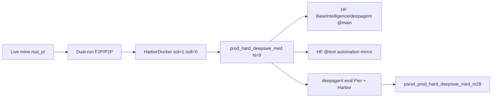

<div align="center">

# DeepAgent

**Hard, Docker-verifiable software-engineering benchmarks from real merged PRs**

[](https://github.com/BaseIntelligence/deepagent/blob/main/LICENSE)
[](https://huggingface.co/datasets/BaseIntelligence/deepagent/tree/main)
[](https://www.python.org/)
[](https://github.com/BaseIntelligence/deepagent)
[](https://github.com/BaseIntelligence/deepagent/blob/main/deepagent/README.md)


</div>

DeepAgent ships **real_pr Harbor hardness packs**: live-mined multi-file pull requests, clone@SHA agent images, held-out verifier tests, and Docker dual-truth (solution reward = 1, null reward = 0). Primary product work runs through the **`deepagent`** CLI in the [GitHub monorepo](https://github.com/BaseIntelligence/deepagent).

| Surface | Ref | Role |
|---|---|---|
| **HF stable pin** | this dataset revision **`main`** | Current product on Hub (**N=9**) |
| **HF automation mirror** | revision **`test`** | CI/dev write target (also **N=9**) |
| **Source code + packs** | [github.com/BaseIntelligence/deepagent](https://github.com/BaseIntelligence/deepagent) | Factory, CLI, full Harbor trees |
| **Scoreboard** | [panel_prod_hard_deepswe_med_m28](https://github.com/BaseIntelligence/deepagent/tree/main/deepagent/datasets/panel_prod_hard_deepswe_med_m28) | Grok 4.5 + Kimi 2.7-code matrix |

> **Viewer table:** `data/packs.jsonl` (and `data/packs.parquet`) lists the **9** certified packs with structural stats + agent-facing `instruction` text only. **Gold `solution.patch` / held-out `test.patch` bodies are not in the table** (they remain under each pack’s Harbor tree for dual-truth oracles).

---

## Current product (authoritative)

| Field | Value |
|---|---|
| **Product root (GitHub)** | [`deepagent/datasets/prod_hard_deepswe_med`](https://github.com/BaseIntelligence/deepagent/tree/main/deepagent/datasets/prod_hard_deepswe_med) |
| **N** | **9** certified packs |
| **unique_repos** | **7** |
| **max packs / repo** | **2** (M28 diversity) |
| **HF stable pin** | this repo revision **`main`** (N=9) |
| **HF automation mirror** | revision **`test`** (also N=9; CI/dev default write target) |
| **Primary CLI** | `deepagent` (`generate` / `upload` / `pull` / `eval` / `oracle`) |
| **Scoreboard** | [panel_prod_hard_deepswe_med_m28](https://github.com/BaseIntelligence/deepagent/tree/main/deepagent/datasets/panel_prod_hard_deepswe_med_m28) |
| **Default eval models** | `x-ai/grok-4.5` + `moonshotai/kimi-k2.7-code` |

### M27 DeepSWE-median hardness floors

Every keep must pass:

- **Multi-file:** source files ≥ **4**, **or** hybrid files ≥ **3** + gold added ≥ **500** + hunks ≥ **14**
- source **hunks ≥ 14**
- gold **added lines ≥ 400**
- **F2P nodes ≥ 5**
- HarborDocker **dual-truth** (sol = 1, null = 0) + prompt–verifier alignment
- live-mined `source_track=real_pr` only (no fixture pad, no hybrid motors)
- **M28 diversity:** max **2** packs per upstream repo

### Pack IDs (N=9)

`realpr-click-3442` · `realpr-itemadapter-101` · `realpr-oauthlib-889` ·
`realpr-packaging-1120` · `realpr-packaging-1267` · `realpr-rich-3930` ·
`realpr-werkzeug-2637` · `realpr-werkzeug-3116` · `realpr-wtforms-923`

### Certified keeps (structural table)

| task_id | repo | files | hunks | added | f2p |
|---------|------|------:|------:|------:|----:|
| `realpr-itemadapter-101` | scrapy/itemadapter | 4 | 15 | 726 | 43 |
| `realpr-packaging-1120` | pypa/packaging | 3 | 24 | 882 | 9 |
| `realpr-packaging-1267` | pypa/packaging | 3 | 22 | 1200 | 144 |
| `realpr-rich-3930` | Textualize/rich | 26 | 29 | 12223 | 78 |
| `realpr-wtforms-923` | pallets-eco/wtforms | 9 | 29 | 483 | 24 |
| `realpr-werkzeug-2637` | pallets/werkzeug | 5 | 24 | 468 | 13 |
| `realpr-werkzeug-3116` | pallets/werkzeug | 16 | 74 | 582 | 28 |
| `realpr-oauthlib-889` | oauthlib/oauthlib | 9 | 17 | 620 | 6 |
| `realpr-click-3442` | pallets/click | 18 | 138 | 960 | 20 |

Product p50: files=9.0 · hunks=24.0 · added=726.0 · f2p=24.0.

`packs_per_repo`: scrapy/itemadapter 1 · pypa/packaging 2 · Textualize/rich 1 · pallets-eco/wtforms 1 · pallets/werkzeug 2 · oauthlib/oauthlib 1 · pallets/click 1.

### Scoreboard (M28 diversified panel)

Durable dual-model matrix on the current product (observational ranking only; dual-solve rate is the hardness quality gate ≤ 0.30):

| Model | pass@1 (k=1) |
|---|---|
| `x-ai/grok-4.5` | **3/9 ≈ 0.33** |
| `moonshotai/kimi-k2.7-code` | **1/9 ≈ 0.11** |
| dual_solve rate | **≈ 0.11** (1/9) |

Evidence on GitHub: [`panel_prod_hard_deepswe_med_m28/SUMMARY.md`](https://github.com/BaseIntelligence/deepagent/blob/main/deepagent/datasets/panel_prod_hard_deepswe_med_m28/SUMMARY.md).

### Historical (not current product)

| Path (GitHub) | Note |
|---|---|
| `deepagent/datasets/test_n10` | **Historical** M16 wave N=10 — not the live hardness product |
| `deepagent/datasets/prod_hard_keep` | Softer M25/M26 band — audit only |
| `deepagent/datasets/deepagent_v1` | Older Real-PR product archive N=20 |
| `deepagent/fixtures/real_pr_ship` | Unit shortlist only — never product N |



---

## Dataset layout (this Hub repo)

```text
README.md                 # this card (YAML configs → Dataset Viewer)
banner.png                # product banner
data/
  packs.jsonl             # N=9 viewer table (no gold patches)
  packs.parquet           # same table (optional parquet)
pack_manifest.json
PRODUCT_README.md
PROVENANCE.md
coverage_stats.json
median_stats.json
tasks/<task_id>/
  task.toml
  instruction.md          # agent-facing problem (no gold leak)
  environment/Dockerfile  # agent image @ base SHA
  tests/…                 # held-out verifier
  solution/…              # multi-file gold (oracle only; not in viewer table)
```

### Viewer columns (`data/packs.jsonl`)

| column | meaning |
|---|---|
| `task_id` | certified pack id |
| `repository_url` | public upstream git URL |
| `base_commit` | 40-char base SHA pin |
| `language` | primary language |
| `license` | upstream license label |
| `source_files` / `source_hunks` / `gold_added_lines` / `f2p_nodes` | structural hardness stats |
| `instruction` | agent-facing problem statement |
| `pack_path` | relative Harbor pack directory |
| `source_track` | always `real_pr` for this product |

**Not included in the viewer table:** `solution.patch` bodies, `test.patch` bodies, API tokens, or `.env` secrets.

---

## Quick start

### Load the viewer table

```python
from datasets import load_dataset

ds = load_dataset("BaseIntelligence/deepagent", split="train")  # 9 rows
print(ds[0]["task_id"], ds[0]["source_hunks"], ds[0]["f2p_nodes"])
```

Prefer a revision pin:

```python
ds_main = load_dataset("BaseIntelligence/deepagent", split="train", revision="main")
ds_test = load_dataset("BaseIntelligence/deepagent", split="train", revision="test")
```

### Pull full Harbor packs (CLI)

```bash
git clone https://github.com/BaseIntelligence/deepagent.git
cd deepagent/deepagent
python3 -m venv .venv && .venv/bin/pip install -e ".[dev]"
cp .env.example .env   # set HF_TOKEN; never commit .env

# Stable product pin
deepagent pull \
  --repo-id BaseIntelligence/deepagent \
  --revision main \
  --out datasets/hf_pull_main

# Automation mirror (also N=9)
deepagent pull \
  --repo-id BaseIntelligence/deepagent \
  --revision test \
  --out datasets/hf_pull_test
```

### Upload / eval (from the factory checkout)

```bash
# Push pack trees to HF stable pin and/or automation mirror
deepagent upload \
  --src datasets/prod_hard_deepswe_med \
  --repo-id BaseIntelligence/deepagent \
  --revision main
deepagent upload \
  --src datasets/prod_hard_deepswe_med \
  --repo-id BaseIntelligence/deepagent \
  --revision test

# Dual-model Pier + Harbor eval (n_concurrent 1..5; hard-stop $600)
deepagent eval \
  --product-root datasets/prod_hard_deepswe_med \
  --max-packs 9 --k 1 --n-concurrent 5 \
  --hard-stop-usd 600 \
  --model x-ai/grok-4.5 \
  --model moonshotai/kimi-k2.7-code \
  --out datasets/panel_prod_hard_deepswe_med_m28

# HarborDocker dual-truth on one pack
deepagent oracle --pack-dir datasets/prod_hard_deepswe_med/tasks/realpr-click-3442
```

Full factory docs: [deepagent/README.md on GitHub](https://github.com/BaseIntelligence/deepagent/blob/main/deepagent/README.md).

---

## Environment notes (abbreviated)

| Variable | Purpose |
|---|---|
| `HF_TOKEN` | Hugging Face upload/pull for this dataset |
| `OPENROUTER_API_KEY` | Live panel / Pier model eval spend |
| `FACTORY_BUDGET_USD` | Hard spend cap (default `600`) |
| `GITHUB_TOKEN` / `GH_TOKEN` | Live Real-PR mine (`export GITHUB_TOKEN="$(gh auth token)"`) |
| `OXYLABS_PROXY_URL` | Optional **SOCKS** proxy for GitHub REST rate-limit relief |
| `ALL_PROXY` / `HTTPS_PROXY` | Optional proxy chain for git/HTTPS clients |

Authenticated GitHub REST plus optional SOCKS is the primary anti-429 path. The Oxylabs **realtime** Web Scraper API is optional and **not required** for GitHub REST/Search mining. Never commit `.env` or log tokens.

---

## Supersession / pin semantics

| Item | Status |
|------|--------|
| **Current stable product (HF `main`)** | M27 floors + **M28 diversity (max 2/repo)** · **N=9** |
| **HF `test` mirror** | Same N=9 product; automation default write target |
| **M16 N=10 / `test_n10` claims** | **Superseded** — historical only |
| Historical softer band | `prod_hard_keep` (M25/M26) — audit only, not this pin |

Do **not** treat model dual-solve alone as a product drop (M25 intrinsic policy). Hardness refusals remain dual-truth fail, prompt–verifier misalignment, structural floors, and high-confidence intrinsic `EASY_REQUEST`.

---

## What you get in a Real-PR pack

Each pack under `tasks/<task_id>/`:

```text
task.toml                 # schema, repository_url, base_commit_hash
instruction.md            # agent-facing problem (no gold leak)
environment/Dockerfile    # agent image @ base SHA
tests/
  Dockerfile
  test.sh / grader.py
  config.json             # fail_to_pass / pass_to_pass
  test.patch              # held-out verifier tests
solution/
  solution.patch          # multi-file product sources
  solve.sh
```

---

## License / secrets

- Dataset card / factory packaging: **MIT** (see monorepo notes; root monorepo may also list Apache-2.0 for other packages).
- Upstream repository licenses vary per pack (`license` column / `pack_manifest.json`).
- **No API tokens, Bearer headers, or `.env` contents** are shipped in this tree. Auth for upload/pull is local-only (`HF_TOKEN` / `HUGGING_FACE_HUB_TOKEN`).

---

## Links

- GitHub monorepo: https://github.com/BaseIntelligence/deepagent
- This dataset (stable): https://huggingface.co/datasets/BaseIntelligence/deepagent/tree/main
- This dataset (automation): https://huggingface.co/datasets/BaseIntelligence/deepagent/tree/test
- Product PRODUCT_README: https://github.com/BaseIntelligence/deepagent/blob/main/deepagent/datasets/prod_hard_deepswe_med/PRODUCT_README.md
- M28 scoreboard: https://github.com/BaseIntelligence/deepagent/blob/main/deepagent/datasets/panel_prod_hard_deepswe_med_m28/SUMMARY.md
