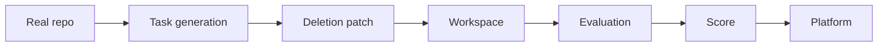

# Architecture Overview

Agent-SWE is a benchmark-generation and evaluation toolkit for software engineering agents. It builds task workspaces from real repositories, then evaluates whether an agent can produce a patch that makes the right tests pass.

The system has two task sources:

1. **Real PR tasks**: mined from GitHub pull requests and exported in a SWE-style format.
2. **Synthetic feature-deletion tasks**: generated from real repositories by deleting a known behavior and asking the agent to restore it.

The synthetic path is inspired by Cursor's public descriptions of how Composer 2 and Composer 2.5 use synthetic, codebase-grounded tasks for agent training.

## High-Level Flow

Legend:

- **Real repo**: a real GitHub repository or local checkout.
- **Task generation**: mining, command discovery, or synthetic task creation.
- **Deletion patch**: only used for synthetic feature-deletion tasks.
- **Workspace**: portable benchmark directory.
- **Evaluation**: Docker-based fail-to-pass scoring.
- **Platform**: downstream challenge infrastructure.

## Main Modules

| Path | Role |
|---|---|
| `src/swe_forge/cli/` | CLI entry points such as `mine`, `synthetic`, `validate`, and `export`. |
| `src/swe_forge/swe/` | Core task model, GitHub mining, enrichment, scoring, and test generation. |
| `src/swe_forge/synthetic/` | Synthetic task generation, feature deletion, leak auditing, and scoring helpers. |
| `src/swe_forge/export/` | Workspace, JSONL, Parquet, and evaluation script export. |
| `src/swe_forge/docker_test/` | Docker-based before/after verification. |
| `scripts/` | Evaluation and revalidation utilities. |

## Synthetic Task Flow

The synthetic flow starts from a real checkout and a target Python symbol:

1. `swe-forge synthetic generate` receives the repo path, repo name, source file, symbol, tests, and output paths.
2. `synthetic.pipeline.create_feature_deletion_task` coordinates task creation.
3. `synthetic.feature_deletion.build_python_function_deletion` parses the source file and replaces the target body with a synthetic failure.
4. The mutation is saved as `deletion_patch.diff`.
5. The inverse mutation is saved as `patch.diff`, the oracle solution.
6. `export.workspace.export_task_to_workspace` writes the workspace directory.
7. The evaluation scripts apply the deletion patch before testing model patches.

## Evaluation Flow

For a synthetic task, the evaluator checks three things:

1. After `deletion_patch.diff`, `fail_to_pass` tests must fail.
2. After applying the candidate patch, `fail_to_pass` tests must pass.
3. `pass_to_pass` tests must also pass, so the candidate did not break unrelated behavior.

For a mined PR task, the same fail-to-pass idea applies, but there is no synthetic deletion patch. The repository starts at the base commit and the candidate patch is expected to repair the original issue.

## Why This Shape Works

This architecture gives Agent-SWE a practical balance:

- real codebases keep tasks realistic;
- synthetic deletion makes task generation scalable;
- Docker keeps evaluation isolated;
- fail-to-pass tests create a clear scoring contract;
- workspace exports make tasks portable for validators and offline experiments.

## Cursor References

The synthetic approach is inspired by public Cursor material:

- [Composer: Building a fast frontier model with RL](https://cursor.com/blog/composer)
- [Introducing Composer 2](https://cursor.com/blog/composer-2)
- [A technical report on Composer 2](https://cursor.com/blog/composer-2-technical-report)
- [Composer 2 Technical Report PDF](https://cursor.com/resources/Composer2.pdf)
- [Introducing Composer 2.5](https://cursor.com/blog/composer-2-5)

## Read Next

- [Synthetic feature deletion](synthetic-feature-deletion.md)
- [Workspace format](workspace-format.md)
- [Evaluation flow](evaluation.md)
