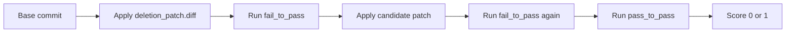
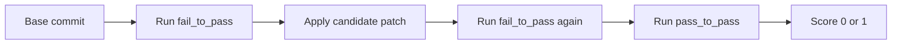

# Evaluation Flow

Agent-SWE evaluation checks whether a candidate patch actually repairs a repository. The scorer does not try to judge style or intent directly. It asks a simpler question: do the right tests fail before the repair and pass after the repair?

That fail-to-pass contract is what makes the benchmark useful for agents. A patch gets credit only if it changes observable behavior in the expected direction without breaking the regression set.

## Synthetic Task Evaluation

Synthetic feature-deletion tasks have one extra setup step: the evaluator first applies `deletion_patch.diff` to create the broken state.



Expected behavior:

1. The repository checks out cleanly at `base_commit`.
2. The synthetic deletion patch applies cleanly.
3. `fail_to_pass` tests fail before the candidate patch.
4. The candidate patch applies cleanly.
5. `fail_to_pass` tests pass after the candidate patch.
6. `pass_to_pass` tests pass after the candidate patch.

If any of those steps fails, the score is `0`.

## Real PR Task Evaluation

Real PR tasks skip the deletion step:



The base repository should already contain the bug or missing behavior. The candidate patch is expected to repair it.

## Test Sets

Agent-SWE separates test commands into two groups.

### `fail_to_pass`

These tests are the main reward signal. They should fail in the broken state and pass after a correct patch.

For synthetic tasks, they usually target the behavior that was deleted. For PR tasks, they usually target the original bug or missing feature.

### `pass_to_pass`

These tests should pass before and after the repair. They protect against broad, destructive patches that satisfy the target test but damage existing behavior.

A candidate patch that passes `fail_to_pass` but fails `pass_to_pass` should not receive credit.

## Docker Verification

The Python verification path lives in `src/swe_forge/docker_test/verification.py`.

At a high level, it:

1. starts an isolated sandbox;
2. clones the repository at `base_commit`, unless a prebuilt image already contains it;
3. installs dependencies;
4. writes generated test files if the task has any;
5. applies the synthetic deletion patch when present;
6. runs before-patch tests;
7. applies the candidate or oracle patch;
8. runs after-patch tests;
9. returns a structured verification result.

Prebuilt images are supported through the `docker` and `environment` sections of `workspace.yaml`. They make repeated validation faster because the repository and dependencies can already be present.

## Local `evaluate.sh`

Every exported workspace also gets an `evaluate.sh` script. It is useful when you want a single portable command that returns a JSON score.

Example:

```bash
./evaluate.sh /workspace/repo
```

Output:

```json
{"score": 1}
```

or:

```json
{"score": 0}
```

The shell evaluator is intentionally conservative. If it cannot apply a patch, run an install command, or make the expected tests pass, it returns `0`.

## Oracle Validation

Before a generated task is trusted, the oracle solution should pass evaluation:

```bash
python3 scripts/run_evaluation.py \
  --predictions_path gold \
  --instance_ids owner-repo-1234 \
  --max_workers 4
```

For synthetic tasks, this checks that:

- `deletion_patch.diff` really creates a failing state;
- `patch.diff` really restores the deleted behavior;
- regression tests still pass.

If the oracle cannot score, the task is not a valid benchmark item yet.

## Model Prediction Validation

Model outputs are provided as JSONL:

```json
{"instance_id": "owner-repo-1234", "model_patch": "diff --git a/..."}
```

The evaluator applies `model_patch` in the same place where it would apply the oracle. The model does not get special access to hidden files.

## Common Failure Modes

| Failure | What it usually means |
|---|---|
| Deletion patch does not apply | The base commit or source file changed. |
| Tests pass before patch | The mutation did not break the intended behavior, or tests are too weak. |
| Oracle patch fails | The task export is inconsistent or install commands are incomplete. |
| Candidate patch does not apply | The model returned an invalid diff or changed the wrong base. |
| `pass_to_pass` fails | The repair broke existing behavior. |
| Timeout | Tests or install steps are too slow for the configured evaluator. |

The best tasks are boring to evaluate: clean checkout, clear failure before repair, clean pass after repair, no flaky external dependencies.
