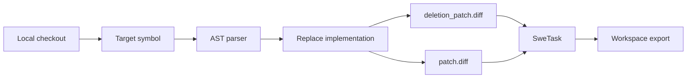

# Synthetic Feature Deletion

Synthetic feature deletion is the part of DeepAgent that turns an existing repository into a new repair task. The idea is deliberately simple: take a behavior that already works, remove it in a controlled way, and ask an agent to recover it from the surrounding code and tests.

This is inspired by Cursor's public descriptions of Composer, Composer 2, and Composer 2.5. In those posts, Cursor describes using synthetic codebase-grounded tasks as a training signal for coding agents: a model works inside a real project, produces a patch, and receives feedback from tests or another verifiable reward source.

Cursor references:

- [Composer: Building a fast frontier model with RL](https://cursor.com/blog/composer)
- [Introducing Composer 2](https://cursor.com/blog/composer-2)
- [A technical report on Composer 2](https://cursor.com/blog/composer-2-technical-report)
- [Composer 2 Technical Report PDF](https://cursor.com/resources/Composer2.pdf)
- [Introducing Composer 2.5](https://cursor.com/blog/composer-2-5)

DeepAgent is not affiliated with Cursor. It uses the same broad public idea, then packages it as an open benchmark workflow.

## What Gets Deleted

The current implementation targets Python functions and methods. You provide:

- the repository checkout;
- the GitHub-style repository name;
- the base commit;
- the source file;
- the symbol to delete;
- tests that should fail when the behavior is removed;
- regression tests that should continue to pass.

The generator parses the Python file with `ast`, finds the requested symbol, and replaces its body with a controlled synthetic failure. The function or method remains in place, so imports and call sites still resolve. What disappears is the real behavior.

That matters because the task should feel like a realistic bug fix, not a broken project skeleton. The agent still has to read nearby code, understand expected behavior, and produce a minimal repair.

## Files Produced

For every synthetic task, DeepAgent creates two important patches:

| File | Meaning | Visible to evaluated agent |
|---|---|---|
| `deletion_patch.diff` | The mutation that removes the working behavior. | No |
| `patch.diff` | The oracle repair, which is the inverse of the deletion patch. | No |

During evaluation, `deletion_patch.diff` is applied first to create the broken state. The agent's candidate patch is then applied on top. `patch.diff` is used only for validation, dataset export, and oracle checks.

## Generation Flow



The core code path is:

1. `swe-forge synthetic generate` parses CLI arguments.
2. `create_feature_deletion_task` builds the task model.
3. `build_python_function_deletion` creates the deletion and oracle patches.
4. `estimate_patch_complexity` adds a rough difficulty signal.
5. `export_task_to_workspace` writes the benchmark workspace.

## CLI Example

```bash
swe-forge synthetic generate \
  --repo-path ./target-repo \
  --repo owner/repo \
  --source-file src/package/module.py \
  --symbol target_function \
  --fail-to-pass "pytest tests/test_target.py -v" \
  --pass-to-pass "pytest tests/ -v" \
  --install-command "pip install -e ." \
  --output-folder ./synthetic_tasks \
  --output-jsonl ./synthetic_tasks.jsonl \
  --overwrite
```

Use focused `fail_to_pass` tests when possible. They are the reward signal for the deleted behavior. Use broader `pass_to_pass` tests to catch accidental regressions.

## Why the Oracle Patch Is Hidden

The oracle patch is useful for the benchmark builder, but it must not be available to the solving agent. If the agent can read `patch.diff`, the benchmark becomes a file-copy task instead of a code-understanding task.

The intended contract is:

1. The benchmark infrastructure applies `deletion_patch.diff`.
2. The agent sees the repository in its broken state.
3. The agent writes its own patch.
4. The evaluator runs the tests and scores the result.

## What Makes a Good Synthetic Target

Good targets tend to have:

- a small, understandable implementation;
- tests that clearly cover the behavior;
- nearby code that gives useful context;
- no external service requirement;
- deterministic behavior;
- a repair that can be made without knowing hidden data.

Avoid targets where the expected behavior is only obvious from private tests, network calls, timing, randomness, or large generated files.

## Current Limits

The first version is intentionally narrow:

- Python only;
- function and method deletion only;
- user-supplied tests;
- local repository checkout required;
- no automatic semantic selection of the best feature to delete.

These limits keep the benchmark honest. The generated task is easy to inspect, the mutation is explicit, and the evaluator can explain why a task passed or failed.
