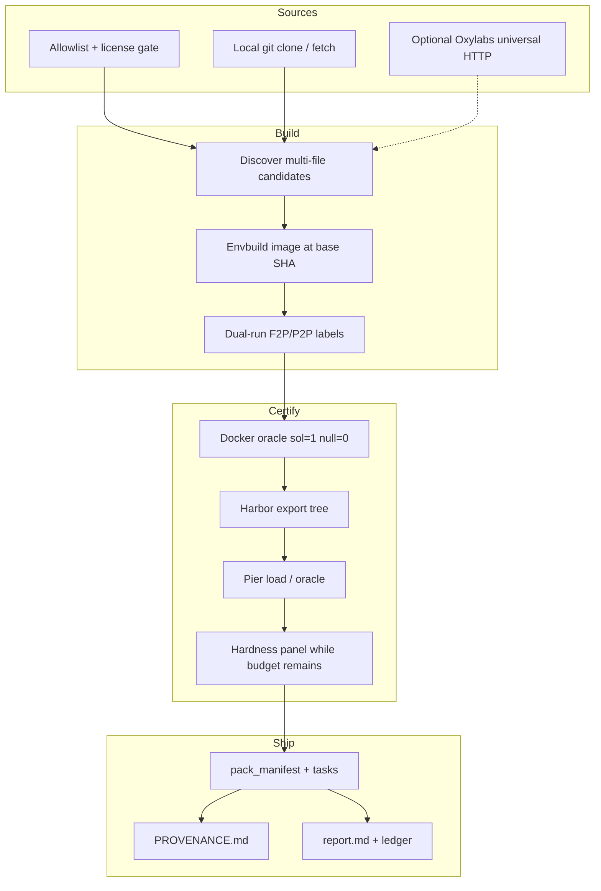

# Architecture

SWE Dataset Factory turns permissive public repositories (and oracle-provable
hybrid seeds) into DeepSWE / Harbor pack trees that agent harnesses can load.

## Product surface

Certified packs ship only under **`datasets/deepswe_v1`**.

| Path | Role |
|---|---|
| `datasets/deepswe_v1` | Product corpus (Docker oracle certified) |
| `datasets/harbor_v1` | Historical multi-lang motor tables (fixture) |
| `datasets/v1` | Historical boltons V1 JSONL (fixture) |

Fixtures may be orbited by offline unit tests. They never count toward product
certified N.

## Pipeline

## Certified keep gates

Every keep under `datasets/deepswe_v1` must satisfy:

1. Real HTTPS `repository_url` and immutable 40-char `base_commit_hash`
2. Multi-file gold solution (≥2 product sources); tests held out in `test.patch`
3. Dual-run fail_to_pass / pass_to_pass node ids
4. Docker oracle: solution reward = 1, null reward = 0
5. Agent isolation (no solution/ or held-out tests in the agent view)
6. `allow_internet=false` at agent + verifier runtime
7. Permissive license only (copyleft / unknown fail closed)
8. Panel attempted while project remaining budget is positive

Fake / stub oracle backends are refused on the deepswe ship and cert paths.

## CLI map

| Command | Stage |
|---|---|
| `discover` / `mine-allowlist` | Candidate discovery |
| `envbuild` | Image build at base SHA |
| `deepswe-oracle` | Docker sol/null cert |
| `export-harbor` | Pack tree writer |
| `pier-cert` | Pier reward evidence |
| `ship-deepswe` | Full product ship to `datasets/deepswe_v1` |
| `ship-harbor` / `ship-v1` | Historical fixture ships only |
| `ledger` | Exact OpenRouter spend |
| `oxylabs-probe` | Live GitHub HTTP smoke (blocked if no creds) |

## Spend and honesty

- Project hard cap: **$600** total OpenRouter spend (exact + reserved).
- Full hardness panel on keeps while remaining budget is positive.
- Language zeros (for example JavaScript or Rust) must appear explicitly in the
  ship report with under-supply notes.
- Historical fixture green tests never replace independent deepswe_v1 N.

## Related code

- `src/swe_factory/pipeline/ship_deepswe.py` — product ship
- `src/swe_factory/harbor/` — export, oracle, pier adapters
- `src/swe_factory/sources/` — allowlist, git mine, oxylabs client
- `src/swe_factory/accounting.py` — ledger
